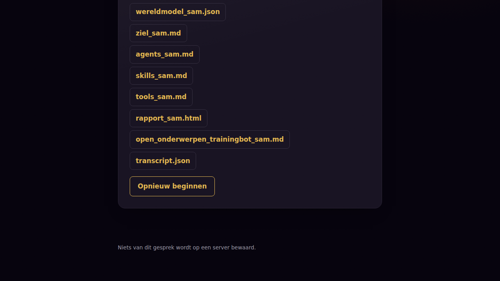
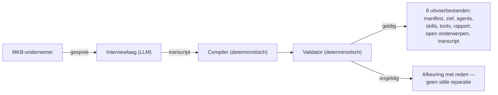

# BedrijfspandAI

**Leg vast wat je bedrijf draaiende houdt — in jouw woorden, met bewijs.**

BedrijfspandAI interviewt een MKB-ondernemer en compileert dat gesprek tot een
gevalideerd, herleidbaar manifest: taken, afhankelijkheden, principes,
vaardigheden en gereedschap — het fundament voor een toekomstige digitale
werknemer. Elke uitspraak in het manifest draagt een dekkingslabel (**GEDEKT**,
**AFGELEID** of **GEEN-DEKKING**) en een verwijzing naar de gespreksbeurt
waarop hij rust. Niets wordt verzonnen; een zichtbaar gat is correct gedrag.

[](https://github.com/RichardClawson013/BedrijfspandAI/actions/workflows/ci.yml)
[](https://github.com/RichardClawson013/BedrijfspandAI/actions/workflows/codeql.yml)
[](https://github.com/RichardClawson013/BedrijfspandAI/actions/workflows/pages.yml)
[](https://scorecard.dev/viewer/?uri=github.com/RichardClawson013/BedrijfspandAI)
[](./LICENSE)

**[→ Probeer de live demo](https://richardclawson013.github.io/BedrijfspandAI/)**



> Deze screenshot wordt automatisch bijgewerkt door CI (`.github/workflows/screenshots.yml`)
> bij elke push naar `master` — geen handmatige mockup.

## Hoe het werkt

Alleen de interviewlaag gebruikt een taalmodel. Compiler en validator daarna
zijn volledig deterministisch en toetsen vorm én herleidbaarheid, niet
inhoudelijke juistheid.



De interviewlaag gebruikt drie onderzoeksmatige technieken, elk met een eigen
stopcriterium — nooit een vast aantal vragen:

- **Laddering** (Kelly, 1955; Reynolds & Gutman, 1988) — attribuut → gevolg →
  waarde, tot een terminale waarde.
- **Critical Decision Method** (Klein, Calderwood & Macgregor, 1989) —
  reconstrueert een beslismoment in sweeps: vrij verhaal → tijdlijn →
  gerichte probes.
- **Exception probing** (Beyer & Holtzblatt, 1997; Cynefin/Snowden) — zoekt
  het punt waar de normale regel breekt.

## Ontwerpprincipes

- **Nooit fabriceren.** Elke node en edge draagt `source_turns` en één
  dekkingslabel. Zonder bronverwijzing keurt de validator het manifest af —
  geen uitzondering, geen stille fallback.
- **Graafconsistentie, niet alleen schema-geldigheid.** De validator vangt
  ook onmogelijke afhankelijkhedengrafen (bv. een taak die van zichzelf
  afhangt), niet alleen ongeldige JSON.
- **Provider-agnostisch.** Het doorgeefluik ondersteunt meerdere aanbieders
  (Google Gemini, OpenRouter) met automatische failover tussen sleutels —
  géén vendor lock-in op één model.
- **Nooit hard stoppen op een technische hapering.** Ongeldige modelantwoorden
  en netwerkfouten leiden tot gracieus herstel (stille herpogingen, een
  "Probeer opnieuw"-knop), nooit tot een kapot of afgebroken gesprek.
- **Niets wordt bewaard.** Het doorgeefluik logt geen gespreksinhoud.

## Tech stack

| Laag | Keuze |
|---|---|
| Interviewlaag | LLM via Google Gemini of OpenRouter (provider-agnostisch) |
| Compiler / validator | Node.js, volledig deterministisch, schema via Ajv (2020-12) |
| Frontend | Vanilla JS (geen framework), esbuild-bundling |
| Doorgeefluik | Node.js-endpoint, tunnel via Cloudflare |
| Tests | `node:test` (unit + golden + integratie), Playwright (e2e) |
| CI/CD | GitHub Actions: tests, lint, CodeQL, OpenSSF Scorecard, Pages-deploy |

## Lokaal draaien

```bash
npm ci
npm test          # 93 tests: unit, golden, integratie
npm run lint
npm run build:web
```

Voor een live gesprek is een draaiend doorgeefluik nodig (zie `SPEC.md` §5-6
voor de volledige architectuur en sleutelbeheer).

## Documentatie

- [`SPEC.md`](./SPEC.md) — volledige specificatie, leidend bij elke afwijking.
- [`PLAN.md`](./PLAN.md) — bouwvolgorde per stap.

## Licentie

[Apache License 2.0](./LICENSE).
